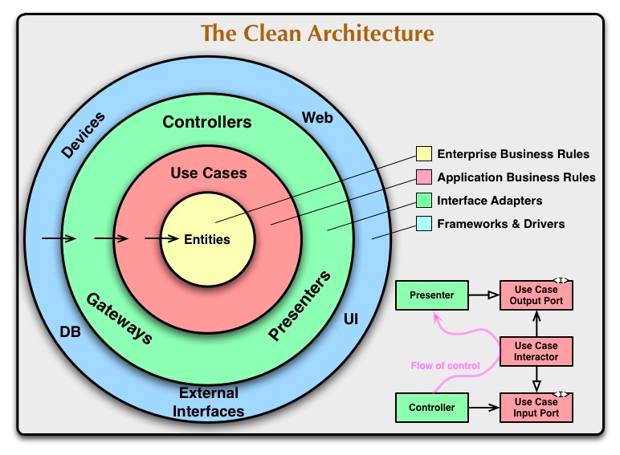

# <a id="contents">go-clean-arch</a>

---

## 架构思想

工程中大量借鉴了 [The Clean Architecture](https://blog.cleancoder.com/uncle-bob/2012/08/13/the-clean-architecture.html) 和 [DDD](https://en.wikipedia.org/wiki/Domain-driven_design) 提出的思想，所以先对这 2 个架构的基本思路进行介绍。

整洁架构的主要思想可以参考 [The Clean Architecture](https://blog.cleancoder.com/uncle-bob/2012/08/13/the-clean-architecture.html) 这篇文章，DDD 可以参考 [阿里技术专家详解 DDD 系列](https://zhuanlan.zhihu.com/p/366395817) 文章。

### 整洁架构的好处

引入整洁架构带来的好处主要包括：

1. 独立于框架：不应该依赖于某种框架，也不需要让系统适应框架。
2. 可被测试性：可以脱离各种依赖进行测试，比如：UI、数据库、Web 服务等外部因素。
3. 独立的 UI：对 UI 进行解耦合，不依赖于具体的 UI 实现，也较为容易的可以切换 UI，比如从 Web 界面切换到命令行界面。
4. 独立于数据库：**业务逻辑**与具体的数据库解耦，不依赖于具体的数据库，不关心是 MySQL、Oracle 或者其他任何类型的数据库。
5. 独立于任何外部的依赖：**业务逻辑**不需要关心任何的外部接口。

### 整洁架构的模型

上图描述了整洁架构的一个基本模型示例，介绍一下文中的基本概念：

1. Entities：即实体，类似于 DDD 中的 Domain 层的概念，里面包含对应的**业务逻辑**。
2. Use Cases：用例，类似于 DDD 中的 Application Service，主要包含各种**业务逻辑的编排**。
3. 各类依赖和数据渲染层在外层，不会对内部的业务逻辑规则产生影响。
4. 最重要的是：在图中的依赖关系，**内部圈不依赖外层圈**。
5. 虽然实际的调用关系是从外层一层一层的调用到最内部的业务逻辑，但是是依靠 [依赖注入](https://zh.wikipedia.org/wiki/%E4%BE%9D%E8%B5%96%E6%B3%A8%E5%85%A5) 的 [控制反转](https://zh.wikipedia.org/zh-hans/%E6%8E%A7%E5%88%B6%E5%8F%8D%E8%BD%AC) 方式进行解耦。

---

## 代码规范

代码的目录结构参考了 [kit](https://github.com/go-kit/kit)、[kratos](https://github.com/go-kratos/kratos)、[project-layout](https://github.com/golang-standards/project-layout) 等工程的代码结构思想，提出下列规范：

从根目录，开始分为：

### /api

**职责**

- 定义接口协议 DTO 结构体。可以引入 `protobuf` 来定义协议结构体。
- 路由注册
- 请求/响应序列化和反序列化

**注意**

一般而言，微服务的协议定义都应该收敛集中存放【方便互相引用】，另外协议定义理应与项目代码分开解耦。故/api目录不推荐使用。

###  /cmd

**职责**

- 当前项目的可执行文件。/cmd目录下的每一个子目录名称都应该匹配可执行文件。比如果我们的项目是一个 grpc 服务，
在/cmd/myapp/main.go中就包含了启动服务进程的代码，编译后生成的可执行文件就是myapp。

**注意**

事实上，常见的微服务通常只有一个可执行文件，所以`/cmd`目录是非必要的。`/cmd`目录存在有一个前提，那就是项目
  有多个可执行文件。

### /internal

强制增加 `/internal` package，防止其他工程随意引用。

- 可以避免循环引用的问题。
- 规范调用关系，如果不是我们自己服务的调用的话，那么就应该使用 rpc 的调用方式。

在这下面可以创建子目录，

| 子目录                | 职责                                                                                                                               | 备注                                                                                                                                                                                                                                                                                                                                                                                                                                                                                                                                                                                                                                                                                                                                                                                                                                                                                                                                                                                                                                                              |
| --------------------- |----------------------------------------------------------------------------------------------------------------------------------| ----------------------------------------------------------------------------------------------------------------------------------------------------------------------------------------------------------------------------------------------------------------------------------------------------------------------------------------------------------------------------------------------------------------------------------------------------------------------------------------------------------------------------------------------------------------------------------------------------------------------------------------------------------------------------------------------------------------------------------------------------------------------------------------------------------------------------------------------------------------------------------------------------------------------------------------------------------------------------------------------------------------------------------------------------------------- |
| **/internal/service** | 1、**重点：参数转换**，并做简单的参数校验。 2、做业务数据的渲染。 ( 由于没有 BFF，所以将 BFF 的功能放到这一层做，但是会导致这一层的代码膨胀 )                                                | service层 --> usecase层 中的 Usecase。                                                                                                                                                                                                                                                                                                                                                                                                                                                                                                                                                                                                                                                                                                                                                                                                                                                                                                                                                                                                                            |
| **/internal/usecase** | 对应 DDD 中的 `Application Service`，这一层是主要的业务逻辑层，包含各 usecase 的调用及对各种数据对象PO的操作    另外这一层需要对repo层做interface，不依赖于数据模型CRUD的具体实现 |                                                                                                                                                                                                                                                                                                                                                                                                                                                                                                                                                                                                                                                                                                                                                                                                                                                                                                                                                                                                                                                                   |
| **/internal/repo**    | 各种数据依赖的具体实现，包括 DB、RPC、缓存等。这里面存放 PO 数据，这些数据就是 **简单的表映射**。                                                                         |                                                                                                                                                                                                                                                                                                                                                                                                                                                                                                                                                                                                                                                                                                                                                                                                                                                                                                                                                                                                                                                  |

[↑ top](#contents)

---
## 数据规范

在整个系统中，主要分为下列几个对象：

1. DTO （Data Transfer Object）- 数据传输对象。对应的是请求、响应的结构体对象。不存在业务逻辑，可以使用 `protobuf` 来约定。
2. DO （Domain Object）- 领域对象。包含各个领域的业务逻辑。
3. PO （Persistant Object）- 持久对象。如果是使用 ORM 的话，那么基本上对应的是表的映射对象。该对象基本上使用贫血模型，除了简单的校验逻辑外，基本上不包含任何业务逻辑。*注意：在有的地方，该对象叫做：DO （Data Object）*。

[↑ top](#contents)

## 参考资料

- [The Clean Architecture](https://blog.cleancoder.com/uncle-bob/2012/08/13/the-clean-architecture.html)

- [Microsoft - Design a DDD-oriented microservice](https://docs.microsoft.com/en-us/dotnet/architecture/microservices/microservice-ddd-cqrs-patterns/ddd-oriented-microservice)

- https://github.com/bxcodec/go-clean-arch

- [The Clean Architecture](https://blog.cleancoder.com/uncle-bob/2012/08/13/the-clean-architecture.html) - Bob 大叔的 Clean 架构

    - 中文翻译：**[架构整洁之道](https://www.cnblogs.com/yjf512/archive/2012/09/10/2678313.html)**

- https://github.com/alibaba/COLA - 阿里巴巴的 Clean Architecture 的示例。

- https://github.com/manakuro/golang-clean-architecture - Golang 的一个 DDD 版本

  推荐来源： [DDD 之代码架构](https://www.yasinshaw.com/articles/112) ，该文章总结了几个重点问题：

    - 聚合根的定义：永远的难题，很难定义。

- [Domain Driven Design: Domain Service, Application Service](https://stackoverflow.com/questions/2268699/domain-driven-design-domain-service-application-service)

  在这里面介绍了什么是 Domain Service：

    - 集合了 domain object 的业务逻辑和业务规则，但是又无法将这些逻辑放到具体的对象里面。
    - Domain Service 是不存在或最好不存在状态的。但是可以改变 Domain Object 中的状态。

- [https://mp.weixin.qq.com/s/Xzlt_WcdcfLWhofafY3c6g](https://mp.weixin.qq.com/s/Xzlt_WcdcfLWhofafY3c6g)

- [一篇文章讲清楚VO，BO，PO，DO，DTO的区别](https://zhuanlan.zhihu.com/p/102389552)